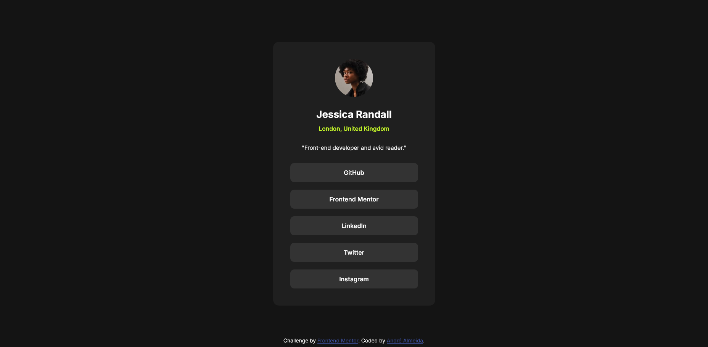

# Frontend Mentor - Social links profile solution

This is a solution to the [Social links profile challenge on Frontend Mentor](https://www.frontendmentor.io/challenges/social-links-profile-UG32l9m6dQ). Frontend Mentor challenges help you improve your coding skills by building realistic projects.

## Table of contents

- [Overview](#overview)
  - [The challenge](#the-challenge)
  - [Screenshot](#screenshot)
  - [Links](#links)
- [My process](#my-process)
  - [Built with](#built-with)
  - [What I learned](#what-i-learned)
  - [Continued development](#continued-development)
- [Author](#author)

## Overview

### The challenge

Users should be able to:

- See hover and focus states for all interactive elements on the page

### Screenshot

### Links

- Solution URL: [Social Links Profile (Github)](https://github.com/andre-almeida-2121/social-links-profile)
- Live Site URL: [Social Links Profile (Vercel)](https://social-links-profile-phi-peach.vercel.app/)

## My process

### Built with

- Semantic HTML5 markup
- CSS custom properties
- Flexbox
- Live Server
- Image preview
- Path Intellisense
- Prettier

### What I learned

I learned a few more things about HTML and CSS, including some important details that can be really significant for the website's visual and responsiveness. Indeed, these challenges gave me an idea, so I will probably update this section with interesting news soon.

### Continued development

I could notice how CSS really matter for the website's visual, so I'm looking forward to giving it more attention.

## Author

- Linkedin - [André Almeida](https://www.linkedin.com/in/andr%C3%A9-almeida-0b6300324/)
- Github - [andre-almeida-2121](https://github.com/andre-almeida-2121)
- Portfolio - [André Almeida](https://ratiopitag.wixsite.com/meusite)
- Frontend Mentor - [@andre-almeida-2121](https://www.frontendmentor.io/profile/andre-almeida-2121)
